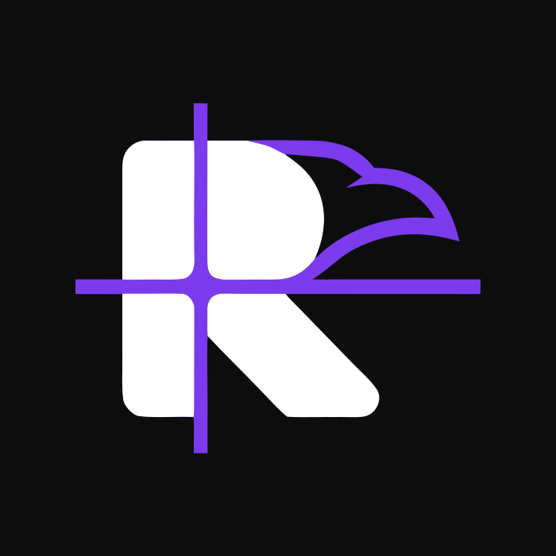
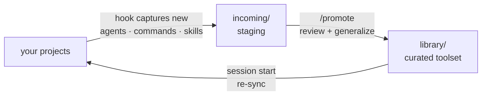

<p align="center">
  
</p>

<h1 align="center">Raven Ledger</h1>

<p align="center">A curated Claude Code toolset — and the sync mesh that keeps it learning from every project you work in.</p>

## How it works



1. **Capture.** When a new agent, command, or skill is written in any wired project — by you or by Claude — a hook stages a copy in `incoming/`. Secrets, stubs, and project data are filtered out; nothing leaves the machine without a human.
2. **Curate.** `/promote` reviews the staging area: reusable tools are generalized and merged into `library/`; project-specific ones are rejected and stay home.
3. **Distribute.** Every wired project re-syncs the library at session start — offline-safe, never blocking.

## What's inside

| | |
|---|---|
| `library/` | 27 agents · 16 commands · 21 skills · 19 stack modules · 8 guardrails · 4 hooks |
| `sync/` | the mesh: capture, pull, promote, secret gate ([details](sync/README.md)) |
| `incoming/` | staging area for captures awaiting `/promote` |

Three ideas hold it together: **cheap by default** (projects get 3-line stubs; a full spec loads only when the tool runs), **enforcement in layers** (deterministic hooks beat permission rules beat prose), and **safe velocity** (reversible work runs unattended; irreversible remote-state ops stop for confirmation; secrets never enter a repo).

`library/skills/design/` vendors five third-party design skills verbatim, credited in [ATTRIBUTION.md](library/skills/design/ATTRIBUTION.md) under their own licenses.

## Run your own

The toolset only makes sense together with its loop, so this repo is a **template,
not a service**: you get your own copy and run your own ledger. Nothing ever flows
back to this repo.

1. Click **Use this template** on GitHub and create your copy — private is fine
   (that's why it's a template: forks of a public repo can never be private, and
   your `incoming/` belongs to you). Clone it.
2. Wire each project you work in:

   ```bash
   sync/install-project.sh /path/to/project
   ```

3. Paste [library/INSTALL_PROMPT.md](library/INSTALL_PROMPT.md) into a Claude Code
   session at that project. Re-running either step is safe; both upgrade in place.

To stay current with this repo's future improvements, add it as a second remote once:

```bash
git remote add upstream https://github.com/ishtvankomka/raven-ledger.git
```

The mesh takes it from there: session starts check upstream on a throttle (read-only,
default every 24h) and print a one-line note when it has new commits; apply them with
`sync/upstream-check.sh --merge` whenever you choose. Nothing is ever merged for you.

Full inventory and routing rules: [library/README.md](library/README.md).
